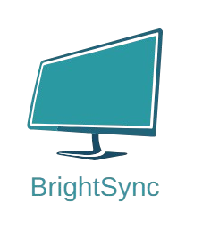

# BrightSync - Cross-Display Brightness Synchronizer

A production-ready Windows desktop application that synchronizes brightness across laptop internal displays and external monitors using native Windows APIs.



## Features

- 🖥️ **Multi-Monitor Support** - Control brightness for internal and external displays
- 🔄 **Auto-Sync** - Synchronize brightness across all connected monitors
- ⚡ **Real-Time Updates** - Smooth animated brightness transitions
- ⌨️ **Global Hotkeys** - Control brightness from anywhere (Ctrl+Alt+Up/Down)
- 🎨 **Modern UI** - Clean, dark-themed React interface
- 📊 **Per-Monitor Control** - Individual brightness control for each display
- 💾 **Persistent Settings** - Remembers your preferences
- 🔔 **System Tray** - Runs in background with quick access menu
- 🚀 **Native Performance** - Direct Windows API integration via C++ addon

## Architecture

BrightSync is built with a layered architecture separating concerns:

```
┌─────────────────────────────────────────┐
│         Renderer Process (UI)           │
│         React + TypeScript              │
└─────────────────┬───────────────────────┘
                  │ IPC (Context Isolated)
┌─────────────────▼───────────────────────┐
│         Main Process (Logic)            │
│    Electron + TypeScript Services       │
│  • BrightnessController                 │
│  • MonitorManager                       │
│  • TrayService                          │
│  • HotkeyService                        │
└─────────────────┬───────────────────────┘
                  │ N-API Bindings
┌─────────────────▼───────────────────────┐
│       Native C++ Addon (Hardware)       │
│    • WMI (Internal Display)             │
│    • DDC/CI (External Monitors)         │
│    • Windows APIs                       │
└─────────────────────────────────────────┘
```

### Data Flow

1. **User Input** → React UI components
2. **IPC Call** → Preload exposes safe API via contextBridge
3. **Main Process** → BrightnessController receives request
4. **Monitor Manager** → Calls native addon via N-API
5. **Native Addon** → Executes Windows API calls
6. **Hardware** → Brightness changes on physical displays
7. **Update** → UI refreshes to show current values

### Why Native Addon?

A native C++ addon was essential for BrightSync because:

1. **Direct Hardware Access** - Windows brightness APIs (WMI, DDC/CI) require native code
2. **No Third-Party Libraries** - Built from scratch using pure Windows APIs
3. **Performance** - Native code provides zero-overhead hardware communication
4. **Type Safety** - N-API provides stable, version-independent Node.js bindings
5. **Reliability** - Direct API calls ensure compatibility across Windows versions

### Hardware Abstraction Layer (HAL)

BrightSync implements a clean HAL architecture that separates hardware communication from application logic:

**Interface Layer** (`IMonitor`):

- Abstract interface for all monitor operations
- Enables testability and future extensibility

**Real Implementation** (`RealMonitor`):

- Uses actual Windows APIs (WMI, DDC/CI)
- Production mode implementation

**Mock Implementation** (`MockMonitor`):

- Simulated monitors for testing
- No hardware dependencies
- Full application functionality

**Factory Pattern**:

- Runtime selection between real and mock
- CLI flag support: `--mock`

This architecture enables:

- ✅ Testing without hardware
- ✅ Rapid development iteration
- ✅ CI/CD integration
- ✅ Future cross-platform support
- ✅ Clean code separation

**Internal Display (Laptop)**:

- Uses WMI (Windows Management Instrumentation)
- Accesses `WmiMonitorBrightness` and `WmiMonitorBrightnessMethods`
- Provides instant brightness control

**External Monitors**:

- Uses DDC/CI (Display Data Channel Command Interface)
- Communicates via VCP (Virtual Control Panel) commands
- Works with most modern external displays that support DDC/CI
- Gracefully handles monitors that don't support the protocol

## Project Structure

```
BrightSync/
├── package.json              # Project dependencies and scripts
├── tsconfig.json            # TypeScript configuration
├── binding.gyp              # Native addon build configuration
│
├── src/
│   ├── main/                # Main process (Electron)
│   │   ├── main.ts         # Application entry point
│   │   ├── ipc.ts          # IPC handlers
│   │   ├── brightness.controller.ts  # Brightness logic
│   │   ├── monitor.manager.ts        # Monitor management
│   │   ├── tray.service.ts          # System tray
│   │   └── hotkey.service.ts        # Global hotkeys
│   │
│   ├── preload/             # Preload scripts
│   │   └── preload.ts      # Context bridge API
│   │
│   ├── renderer/            # Renderer process (UI)
│   │   ├── index.html      # Main HTML
│   │   ├── app.tsx         # React app component
│   │   ├── styles.css      # Stylesheet
│   │   └── components/     # React components
│   │       ├── BrightnessSlider.tsx
│   │       ├── MonitorCard.tsx
│   │       └── SyncToggle.tsx
│   │
│   └── shared/              # Shared code
│       ├── types.ts        # TypeScript types
│       └── constants.ts    # Constants
│
├── native/                  # Native C++ addon
│   ├── brightness.h        # Header file
│   ├── brightness.cc       # N-API bindings
│   ├── monitor_interface.h # HAL interface
│   ├── real_monitor.h      # Real hardware header
│   ├── real_monitor.cpp    # Real hardware implementation
│   ├── mock_monitor.h      # Mock implementation header
│   ├── mock_monitor.cpp    # Mock implementation
│   ├── monitor_factory.h   # Factory header
│   ├── monitor_factory.cpp # Factory implementation
│   ├── win_internal.cpp    # Internal display (WMI) - deprecated
│   └── win_ddc.cpp        # External displays (DDC/CI) - deprecated
│
├── build/                   # Build output
└── dist/                    # Compiled TypeScript
```

## Installation

### Prerequisites

- **Windows 10/11** (64-bit)
- **Node.js** 18.x or higher
- **Python** 3.x (for node-gyp)
- **Visual Studio Build Tools** 2019 or later
  - Install from: https://visualstudio.microsoft.com/downloads/
  - Required: "Desktop development with C++" workload

### ⚠️ Administrator Privileges Required

**BrightSync requires administrator privileges to control internal laptop display brightness.**

**Why?** Windows uses WMI (Windows Management Instrumentation) for internal display brightness control, which requires elevated privileges. External monitors using DDC/CI may work without admin rights, but internal displays will not respond without elevation.

**How to Run with Admin Rights:**

#### Development Mode

```powershell
# Option 1: Use the admin launcher script (recommended)
npm run dev:admin

# Option 2: Run PowerShell as Administrator, then:
npm start
```

#### Production/Installed App

Right-click the BrightSync shortcut and select **"Run as administrator"**

**What happens without admin rights?**

- App will show a warning dialog on startup
- External monitors may work normally
- Internal laptop display brightness will NOT change
- WMI calls will fail silently

### Install Build Tools (First Time)

```powershell
# Install windows-build-tools (installs Python and VS Build Tools)
npm install --global windows-build-tools

# Or manually install Visual Studio Build Tools
# Download from: https://visualstudio.microsoft.com/vs/older-downloads/
# Select: "Desktop development with C++"
```

### Clone and Install

```powershell
# Clone repository
git clone https://github.com/yourusername/brightsync.git
cd brightsync

# Install dependencies
npm install

# Build native addon and TypeScript
npm run build

# Start application
npm start
```

## Development Setup

### Mock Mode for Testing

BrightSync now includes a **Hardware Abstraction Layer (HAL)** with mock mode for testing without actual hardware:

```powershell
# Run with simulated monitors (no hardware required)
npm start -- --mock
```

Mock mode provides:

- 3 simulated monitors (1 internal, 2 external)
- Full application functionality without hardware
- Console logging of all operations
- Perfect for development and testing

See [HAL_MOCK_MODE.md](HAL_MOCK_MODE.md) for detailed documentation.

### 1. Install Dependencies

```powershell
npm install
```

### 2. Build Project

```powershell
# Clean previous builds
npm run clean

# Build native addon
npm run build:native

# Build TypeScript
npm run build:ts

# Or build everything
npm run build
```

### 3. Run in Development Mode

```powershell
npm run dev
```

This will:

1. Compile TypeScript
2. Build native addon
3. Start Electron application

### 4. Debug

The application opens DevTools automatically in development mode (when `NODE_ENV=development`).

## Build for Production

### Create Installer

```powershell
# Build and create Windows installer
npm run dist

# Output will be in: build/BrightSync Setup 1.0.0.exe
```

### Package Without Installer

```powershell
# Create unpacked directory
npm run pack

# Output will be in: build/win-unpacked/
```

## Usage

### Master Brightness Control

1. Launch BrightSync
2. Ensure "Sync ON" is enabled
3. Drag the master brightness slider
4. All monitors adjust proportionally in real-time

### Per-Monitor Control

1. Disable sync by clicking "Sync OFF"
2. Adjust individual monitor sliders
3. Each monitor can be controlled independently

### Global Hotkeys

- **Ctrl + Alt + Up** - Increase brightness by 10%
- **Ctrl + Alt + Down** - Decrease brightness by 10%

Works even when the app is minimized!

### System Tray

Right-click the tray icon for quick access:

- Show BrightSync
- Increase/Decrease Brightness
- Toggle Sync
- Quit

### Settings

Settings are automatically saved:

- Sync enabled state
- Last brightness value
- Launch on startup preference

Stored in: `%APPDATA%/brightsync/config.json`

## Technical Details

### IPC Channels

The app uses typed IPC communication:

| Channel              | Purpose                  | Direction       |
| -------------------- | ------------------------ | --------------- |
| `monitors:get`       | Fetch all monitors       | Renderer → Main |
| `brightness:get`     | Get monitor brightness   | Renderer → Main |
| `brightness:set`     | Set monitor brightness   | Renderer → Main |
| `sync:toggle`        | Toggle sync state        | Renderer → Main |
| `settings:get`       | Get app settings         | Renderer → Main |
| `settings:set`       | Save app settings        | Renderer → Main |
| `brightness:changed` | Brightness changed event | Main → Renderer |

### Brightness Algorithm

When master brightness changes to value `V`:

```
For each monitor M:
  percentage = V / 100
  target = M.min + (M.max - M.min) * percentage
  setBrightness(M.id, target)
```

### Smooth Transitions

Brightness changes are animated:

```
stepSize = 2 units
stepDelay = 10ms
steps = ceil(|target - current| / stepSize)

For each step:
  current += (target - current) / steps
  setBrightness(round(current))
  sleep(stepDelay)
```

This creates a smooth visual transition instead of instant jumps.

### Monitor Detection

**Internal Display**:

- Detected via monitor enumeration
- Checked if primary monitor with internal characteristics
- Uses WMI for brightness control

**External Monitors**:

- Enumerated via `EnumDisplayMonitors`
- Physical monitors obtained via `GetPhysicalMonitorsFromHMONITOR`
- DDC/CI capability tested before adding to list
- Monitors without DDC/CI support are noted but may not be controllable

### Error Handling

The application gracefully handles:

- Monitors that don't support DDC/CI
- Missing administrator privileges (shows warning dialog)
- Monitor hot-plug/unplug during runtime
- COM initialization failures
- Invalid brightness values (clamped to valid range)
- Native addon loading failures

**Note**: Internal display brightness control requires administrator privileges due to Windows WMI requirements.

## Troubleshooting

### Native Addon Won't Build

**Error**: `node-gyp rebuild` fails

**Solution**:

1. Ensure Visual Studio Build Tools are installed
2. Install Python 3.x
3. Run as Administrator (if needed)
4. Clean and rebuild:
   ```powershell
   npm run clean
   npm run build:native
   ```

### Brightness Not Changing

**Internal Display (Laptop)**:

⚠️ **Most Common Issue: Missing Administrator Privileges**

Internal laptop displays require administrator privileges because Windows uses WMI (Windows Management Instrumentation) for brightness control.

**Solutions:**

1. **Run as Administrator**: Use `npm run dev:admin` or right-click the app and "Run as administrator"
2. Check if the admin warning dialog appeared on startup
3. Ensure WMI service is running: `Get-Service Winmgmt` in PowerShell
4. Update graphics drivers
5. Check Windows power settings haven't disabled brightness control

**External Monitors**:

- Ensure monitor supports DDC/CI
- Check monitor OSD settings for DDC/CI enable
- Try unplugging/replugging monitor
- Some monitors don't support DDC/CI over certain ports (try DisplayPort instead of HDMI)

### Permission Errors / Access Denied

**If you see "Failed to get WMI service" or "Access Denied" errors:**

This means the app is running without administrator privileges. Internal display brightness control **requires** elevation.

**Solutions:**

1. Close the app completely (including system tray)
2. Restart with admin rights:
   ```powershell
   npm run dev:admin
   ```
3. For installed app: Right-click shortcut → "Run as administrator"
4. The app will now show "✓ Running with administrator privileges" in the console

**Note:** External monitors may work without admin rights, but internal displays will NOT work without elevation.

### Hotkeys Not Working

- Ensure no other app is using the same hotkeys
- Check if BrightSync is running in system tray
- Restart the application

## Future Improvements

- [ ] **Monitor Profiles** - Save brightness presets for different scenarios
- [ ] **Time-Based Auto-Adjustment** - Reduce brightness at night
- [ ] **Ambient Light Sensor** - Auto-adjust based on room lighting
- [ ] **Custom Hotkeys** - User-configurable keyboard shortcuts
- [ ] **Multi-Language Support** - Internationalization
- [ ] **Gamma Correction** - Advanced color temperature control
- [ ] **Per-App Brightness** - Different brightness for different applications
- [ ] **Command-Line Interface** - Scriptable brightness control
- [ ] **Linux/macOS Support** - Cross-platform brightness control
- [ ] **Monitor Profiles Export/Import** - Share configurations

## Technologies Used

- **Electron** - Desktop application framework
- **TypeScript** - Type-safe JavaScript
- **React** - UI framework
- **Node.js** - JavaScript runtime
- **N-API** - Native addon interface
- **C++** - Native code for Windows APIs
- **Windows WMI** - Internal display control
- **DDC/CI** - External monitor control
- **electron-store** - Settings persistence
- **electron-builder** - Application packaging

## System Requirements

- **OS**: Windows 10 (1809+) or Windows 11
- **RAM**: 100 MB
- **Disk**: 150 MB
- **Display**: Any monitor (internal or external with DDC/CI support)

## License

MIT License - See LICENSE file for details

## Contributing

Contributions are welcome! Please:

1. Fork the repository
2. Create a feature branch
3. Make your changes
4. Add tests if applicable
5. Submit a pull request

## Support

For issues, questions, or suggestions:

- Open an issue on GitHub
- Email: utkarshpawade2@gmail.com

## Acknowledgments

- Windows WMI documentation
- DDC/CI specification
- Electron and Node.js communities
- N-API documentation and examples

---

**Built with 🛠️☕ for Windows users who want seamless multi-monitor brightness control**
